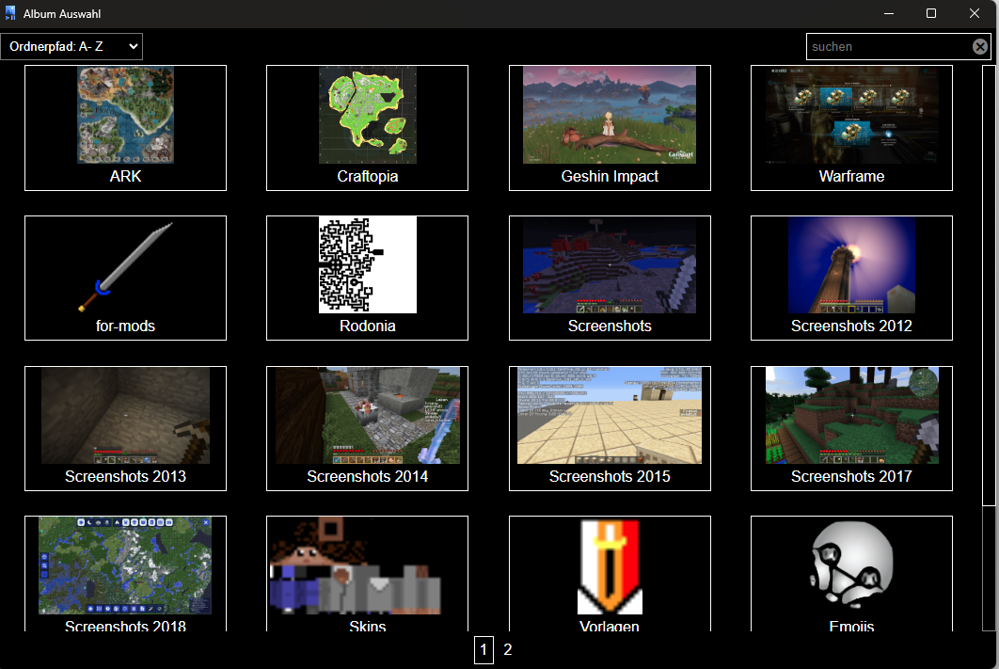
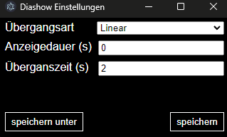

# Disclaimer

Currently the application is not localized.  
Therefore controls and menu paths will be contained in german and english in this guide.  
First the german version (as is the application) and the in brackets the english version:  
E.g. `Datei > Öffnen (File > Open)`  
The reasoning behind this is to make a potential future localisation easier.  

**THERE IS NO TIMELINE OR COMMITMENT FOR A LOCALISATION**  
Maybe it will be done, maybe it won't.

# Abstract

The slideshow viewer is an application to present images from folders.  
It provides options to configure the way of presenting them.  

Furthermore it provides several features to ease the access to them.  

# Open album

There are multiple options how to open an [album].

## Direct

The shortcut für this function is `Ctrl+O`.  
The function can also be called via the menu path `Datei > Öffnen (File > Open)`.  
In both cases an open-folder-dialog will open.  
If the selection is accepted by `Ordner auswählen (choose folder)`, the selected folder is opened as [album].

If the selection is canceled by `Abbrechen (cancel)`, the currently loaded [album] is closed.  
After that the welcome-screen of the application is displayed.

## Album selection

[album-selection]: #album-selection

The aim of this function is to make switching between different [album]s more easy.

The shortcut for this function is 'Alt+A'.  
The function can also be called via the menu path `Datei > Album Auswahl (File > Album Selection)`.  
In both cases a open-folder-dialog will open.  
This dialog allows to select multiple folders.

If the selection is accepted by `Ordner öffnen (choose folder)`, the [album-selection-window] will open.  
This window shows all [album]s contained in the selected folders.  
If a folder contains multiple subfolders with images, each of those subfolders is displayed as [album].

### Album selection window

[album-selection-window]: #album-auswahl-window

To load into [slideshow-window] an [album] click on it in the [album-selection-window].

Each [album] is displayed by a [cover] und the name of its folder.  
Additional information of an [album] is displayed on hovering over it.  

Further [album]s can be added by calling the function again via menu item or shortcut.  
To clear the selection, close the [album-selection-window].  
A maximum of 20 [album]s can be displayed at once.  
To access further [album]s use the pagination at the bottom of the window.

### Search and sort

The displayed [album]s can be sorted via the drop-drop-selection in the top left of the window.  
Searching for specific [album]s can be done via the search field in the top right.  
If a text is entered into the search field and confirmed by hitting `Enter`, only [album]s whose names contain the entered text are displayed.  
To remove the search filter, use the `x` an the end of the search field.  
Alternatively use clear the search field and hit `Enter`.

### Cover

[cover]: #cover

An image to represent an [album].  
The first image is used as [cover] is used, if non is defined for the [album].  
The [cover] of an [album] can be changed by `rightclicking` it in the [album-selection-window].  
If a [cover] image is located in the folder of an [album], this setting persists when the folder is moved to another location.  
The first image is used, if the configured [cover] image does not exists (anymore).

**Technical details**
> A .json file is created in the [album]s folder, to store the [cover] configuration.  
> Deleting this file only cause a reset of the [cover].  
> The file can be transfered to other PCs along with the folder.

# Slideshow window

[slideshow-window]: #slideshow-window

The [slideshow-window] is the main window of the application.  
On startup a welcome screen is displayed.  
Its function is to display the images of an [album] as [slideshow].  
Furthermore it allows to [control](#slideshow-controls) the [slideshow].

## Slideshow controls

[slideshow-controls]: #slideshow-controls

If the mouse is moved to the bottom of the [slideshow-window], the [slideshow-controls] are displayed.

From left to right the buttons provide the following functions:

- Go to the previous image of the [album].  
The shortcut is `left arrow key`.
- Start or stop the [slideshow].  
The shortcut is `Space`.
- Go to the next image of the [album].  
The shortcut is `right arrow key`.

By starting the [slideshow] the next image of the [album] is displayed automatically after a [configurable](#slideshow-configuration) amount of time.

# Slideshow configuration

This function provides a configuration window.  
This window the configuration of the [slideshow] can be adjusted.

## Slideshow parameters

| Parameter | Allowed values | Description |
| --- | --- | --- |
| Übergangsart (Transition type) | "Linear (linear)", "Fließend (ease)", "Ausklinged (ease in)", "Nachhall (ease out)", "Ausklingend und Nachhall (ease in and out)" | Sets the type of the transition between two images. See [slideshow-transitions]. |
| Anzeigedauer (s) (Display duration (s)) | All positive numbers (including 0) | The duration an images is displayed when the [slideshow] is running in seconds. |
| Übergangszeit (s) (Transition duration (s)) | All positive number (including 0) | The duration of the transition between to images in seconds. |

## Slideshow transitions

[slideshow-transitions]: #slideshow-transitions

All transition type have in common, that the next images is place behind the current.  
The opacity of the current image is lower bit by bit.  
The transition type sets the course of the speed in which the opacity decreases.

| German name (Translated name) | Description |
| --- | --- |
| Linear (linear) | Create a constant transition speed. |
| Fließend (ease) | The transition starts slow, gets faster in the middle and slows down at the end. |
| Ausklinged (ease in) | A transition, which starts slowly. |
| Nachhall (ease out) | A transition, which ends slowly. |
| Ausklingend und Nachhall (ease in and out) | A transition, which starts and ends slowly. |

# Glossary

## Album

[album]: #album
[Album]: #album

In general the term "[album]" is used to describe a set of images in the context of this application.  
Those are loaded from folders, therefore the term might also be used for those folders.  

## Slideshow

[slideshow]: #slideshow
[Slideshow]: #slideshow

In the context of this application the term "[slideshow]" is used for sequences of images.